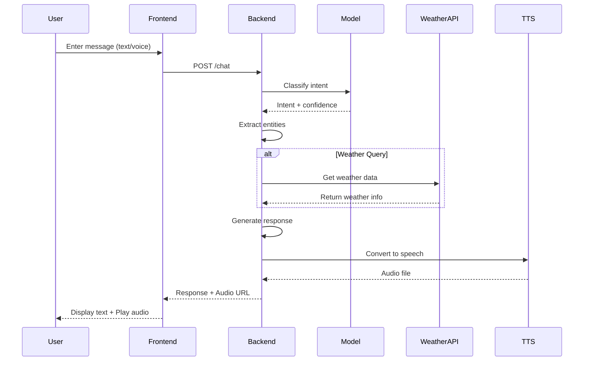
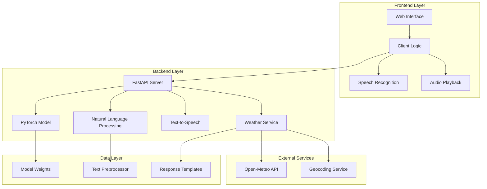

# Weather Voice Assistant - System Design

## Overview

The Weather Voice Assistant is a full-stack application that provides weather information through natural language interaction, powered by PyTorch for intent classification and featuring voice input/output capabilities. The system is built with a FastAPI backend and a vanilla JavaScript frontend.

## System Architecture

### Component Overview

The system is divided into several key components:

1. **Frontend Layer**
   - Web Interface (`frontend/index.html`, `frontend/style.css`)
   - Client-side Logic (`frontend/app.js`)
   - Voice Interface (Web Speech API)

2. **Backend Layer**
   - FastAPI Server (`backend/main.py`)
   - PyTorch Model (`backend/models/weather_classifier.py`)
   - Weather Service (`backend/services/weather.py`)
   - Text-to-Speech Engine (pyttsx3)

3. **External Services**
   - Open-Meteo Weather API
   - Geocoding Service

### Call Flow Diagram

### Functional Block Diagram

## Component Details

### Frontend Components

1. **Web Interface (`frontend/index.html`, `frontend/style.css`)**
   - Responsive chat interface
   - Voice input button
   - Message history display
   - Status indicators
   - Auto-speak toggle

2. **Client Logic (`frontend/app.js`)**
   - Manages user interactions
   - Handles WebSocket communication
   - Implements speech recognition
   - Controls audio playback
   - Manages chat state

### Backend Components

1. **FastAPI Server (`backend/main.py`)**
   - RESTful API endpoints
   - Request/response handling
   - CORS middleware
   - Error handling
   - Background task management

2. **Weather Assistant (`backend/main.py:WeatherAssistant`)**
   - Intent classification
   - Entity extraction
   - Response generation
   - Weather data processing
   - TTS integration

3. **Weather Service (`backend/main.py:WeatherAPIClient`)**
   - Open-Meteo API integration
   - Geocoding service integration
   - Weather data transformation
   - Error handling

4. **PyTorch Model (`backend/models/weather_classifier.py`)**
   - Intent classification
   - Model inference
   - Confidence scoring

### Data Flow

1. **User Input Processing**
   - Text input or voice input via Web Speech API
   - Frontend sends request to backend
   - Backend processes message through PyTorch model
   - Intent classification and entity extraction

2. **Weather Data Retrieval**
   - Location extraction from user query
   - Geocoding to get coordinates
   - Weather data fetching from Open-Meteo
   - Data transformation to standard format

3. **Response Generation**
   - Template-based response generation
   - Weather data integration
   - Text-to-speech conversion
   - Audio file generation and storage

4. **Response Delivery**
   - JSON response with text and metadata
   - Audio URL for voice playback
   - Frontend rendering and audio playback

## Security Considerations

1. **API Security**
   - CORS configuration for allowed origins
   - Input validation using Pydantic models
   - Rate limiting (to be implemented)
   - Error handling and logging

2. **Data Security**
   - No sensitive data storage
   - Environment variable management
   - Secure API key handling

## Scalability Considerations

1. **Backend Scalability**
   - Stateless API design
   - Background task processing
   - Docker containerization
   - Railway deployment support

2. **Frontend Scalability**
   - Static file serving
   - GitHub Pages deployment
   - CDN support (to be implemented)

## Monitoring and Logging

1. **Backend Monitoring**
   - Health check endpoint
   - Model information endpoint
   - Logging configuration
   - Error tracking

2. **Frontend Monitoring**
   - Console logging
   - Error handling
   - Status indicators
   - User feedback

## Future Improvements

1. **Feature Enhancements**
   - Multi-language support
   - Weather alerts
   - Historical weather data
   - Custom voice models

2. **Technical Improvements**
   - WebSocket for real-time updates
   - Caching layer
   - Load balancing
   - Advanced error recovery 