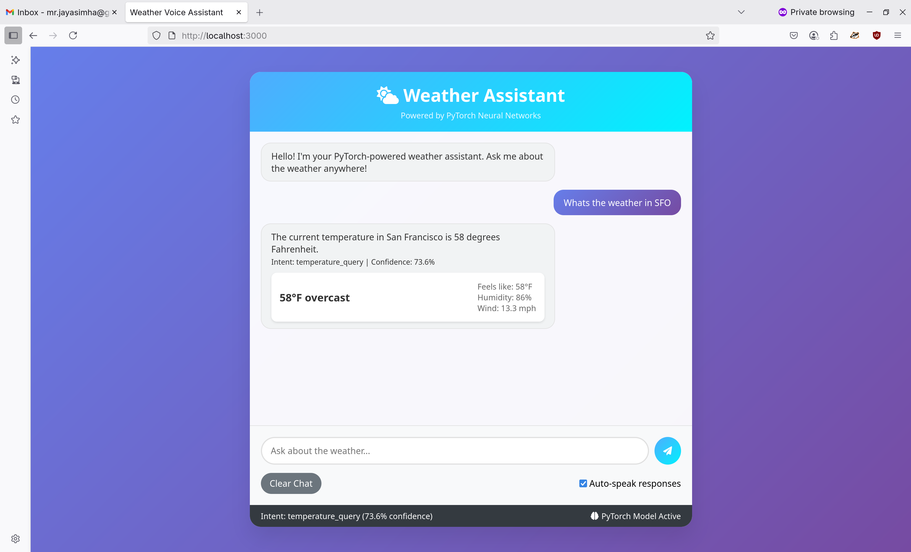
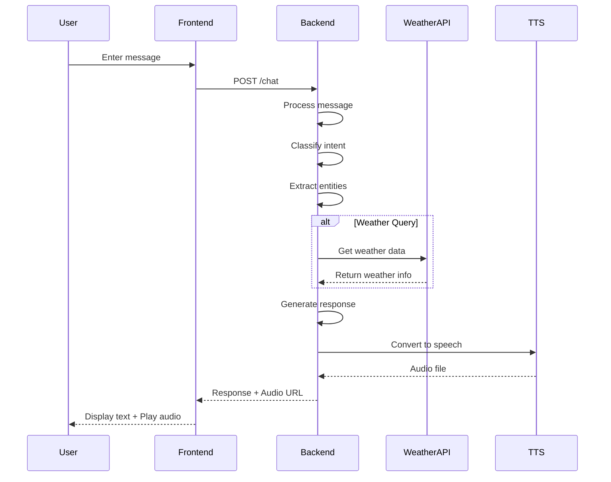
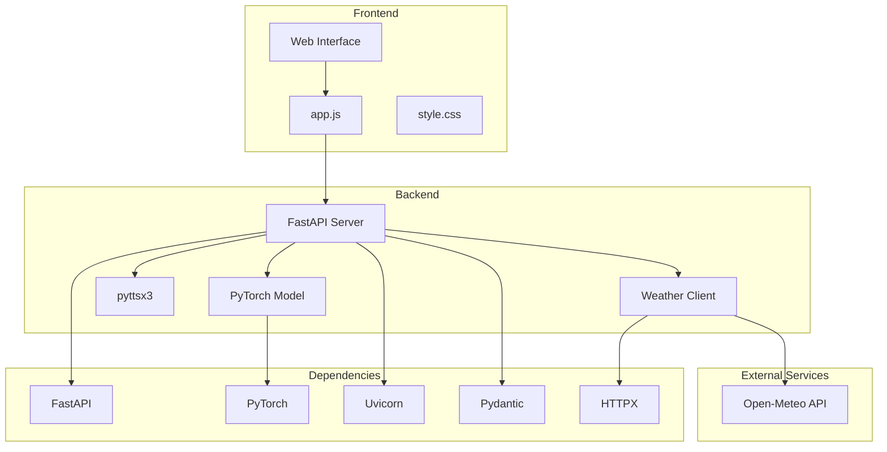

# Weather Voice Assistant

A PyTorch-powered weather assistant with voice capabilities, built with FastAPI and vanilla JavaScript.



## Project Structure

```
mini-jarvis/
├── backend/           # FastAPI backend
│   ├── main.py       # API implementation
│   ├── models/       # PyTorch models
│   ├── data/         # Training data
│   └── run.py        # Server runner
├── frontend/         # Web interface
│   ├── index.html    # Main page
│   ├── style.css     # Styling
│   └── app.js        # Frontend logic
└── Dockerfile        # Backend deployment
```

## System Architecture

### Call Flow Diagram



### Component Architecture



## Local Development

### Backend

1. Navigate to the backend directory:
   ```bash
   cd backend
   ```

2. Install dependencies:
   ```bash
   pip install -r requirements.txt
   ```

3. Start the server:
   ```bash
   python run.py
   ```

The backend will be available at `http://localhost:8000`

### Frontend

1. Open `frontend/index.html` in your browser
2. The frontend will connect to the local backend automatically

## Deployment

### Backend (Railway)

1. Push your code to GitHub
2. Create a new project on Railway
3. Connect your GitHub repository
4. Railway will automatically detect the Dockerfile and deploy your backend
5. Note the deployed URL (e.g., `https://your-app.railway.app`)

### Frontend (GitHub Pages)

1. Create a new repository on GitHub
2. Push the `frontend` directory to the repository
3. Enable GitHub Pages in the repository settings
4. Update the API URL in `frontend/app.js` with your Railway backend URL
5. Your frontend will be available at `https://yourusername.github.io/repo-name`

## Environment Variables

### Backend

Create a `.env` file in the backend directory:

```env
# Server configuration
HOST=0.0.0.0
PORT=8000

# Model paths
MODEL_PATH=models/best_model_epoch_19.pth
PREPROCESSOR_PATH=data/preprocessor.json

# TTS configuration
TTS_RATE=180
TTS_VOLUME=0.9
```

## API Endpoints

- `GET /health` - Health check
- `GET /model/info` - Model information
- `POST /chat` - Chat endpoint
- `GET /weather/{location}` - Direct weather data

API documentation is available at `/docs` when the server is running.

## Features

- Voice input/output
- Real-time weather data
- Intent classification with PyTorch
- Natural language processing
- Responsive web interface

## License

MIT License
